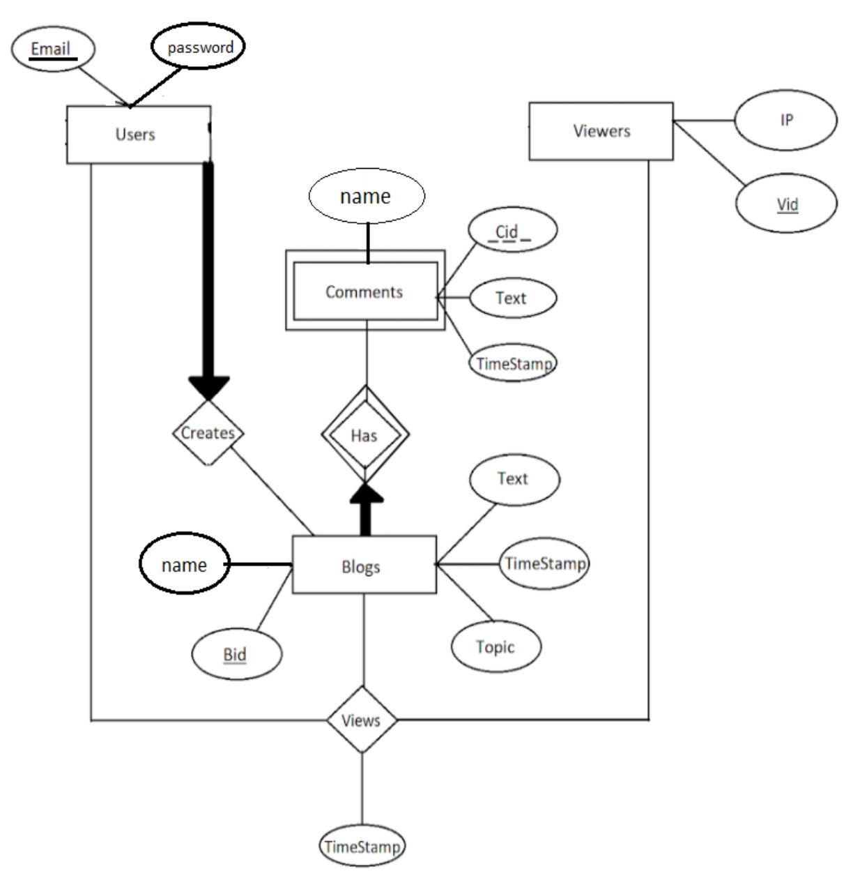

# CSC_675-Blog_Database

This database is designed to store and manage blogs, allowing users to create text-based entries with topics, images, and content. Internet viewers can access and read these blogs. Users can engage in text-based communication and leave comments on blogs.

Every user within the system possesses a name, email address, and password. While the email address serves as the primary means to ensure uniqueness and contactability, names and passwords are also associated with each user. In addition, the database includes a functionality to track blog visits, providing users with corresponding timestamps for each visit.

Overall, this database facilitates blog creation, user interaction, and visitor tracking, creating an engaging environment for blogging and communication.

# Designs

- ER Diagram


- Design details

https://docs.google.com/document/d/1u0KXnOjF5ggnSMAvRysqfVZXLwtYit4NaMpdTuMmek8/edit?usp=sharing

# Team Members

This team project is created by:

- Steven Liao
- Kelvin Ching Kiu Chan (Github: chan34kelvin)

# Installation

Git clone this repo and follow the instructions below to use this database in your local machine.

## Prerequisites

Please have the following.
- MySQL Workbench and a database connection to create schemas.

## Inside Workbench

- Find server tab on top of the workbench and open it.
- Find data import inside server tab and click it.
- Click ... inside "Import from Dump" and choose ```blog_database``` inside the repo folder.
- In "Default Target Schema:" click "New..." and name it ```blog_database```
- Click "start import" to finish importing
- Refresh schemas to see if the container is created and ready to use.

## To Use

- Go to query in the workbench and type
```
use blog_database;
```
- click the lighting button to execute. Now you're able to insert search queries inside the query box for testing.
- In case of error, here is a doc that contains all the create commands to make it from scratch.

https://docs.google.com/document/d/1zfW3RrNYqqmPZEy1ZN55anPhXlA90druCgxr-Ukw2rM/edit?usp=sharing

# Search Queries

Here is a list of search queries to test the database.

- Finds the number of comments for all blogs.
```SELECT COUNT(*), A.bid FROM has_comments A, create_blog B WHERE A.bid= B.bid GROUP BY B.bid;```

- Finds the blog id and number of comments of the blog with the most comments.
```
SELECT E.bid, counts FROM 
(SELECT COUNT(*) AS counts, B.bid AS bid FROM 
has_comments A, create_blog B WHERE A.bid= B.bid GROUP BY B.bid) E 
WHERE counts >= ALL 
(SELECT COUNT(*) AS C FROM has_comments A, create_blog B WHERE A.bid= B.bid GROUP BY B.bid) ;
```

- Finds users with the most blogs created.
```
SELECT U1.email, C FROM
(SELECT COUNT(*) as C, B.email as email FROM
	create_blog B, users U
	WHERE B.email= U.email
	GROUP BY U.email	) U1
WHERE C = (SELECT MAX(count) FROM (SELECT COUNT(*) as count FROM
	create_blog B, users U
	WHERE B.email= U.email
	GROUP BY U.email	) T);
```

- Finds all users with no blogs.
```
SELECT U.email FROM
users U
WHERE U.email NOT IN (SELECT B.email FROM create_blog B
WHERE B.email = U.email);
```

- Finds the number of blogs that don't have comments.
```
SELECT COUNT(*), B.bid FROM
	create_blog B
	WHERE NOT EXISTS (SELECT H.bid FROM has_comments H WHERE H.bid= B.bid);
```

- Finds the users with 3 or more blogs.
```
SELECT U.email, COUNT(*) FROM
	users U, create_blog B
	WHERE U.email= B.email
	GROUP BY B.email
	HAVING COUNT(*) > 3;
```

- Finds the days where there were more than 20 views.
```
SELECT COUNT(*), V.created_date
FROM views V
GROUP BY V.created_date
HAVING COUNT(*) > 20;
```

- Finds the topics where all comments on these blogs are more than 3.
```
SELECT B.topic
FROM create_blog B
WHERE B.bid = ANY(SELECT C.bid FROM
	has_comments C
	GROUP BY C.bid
	HAVING COUNT(*) >3);
```

# Dataset Reference

References

Diaz, Mark, 2020, "Time Goes By blog posts and comments (up to 08/2016)", https://doi.org/10.7910/DVN/ILHHHY, Harvard Dataverse, V1